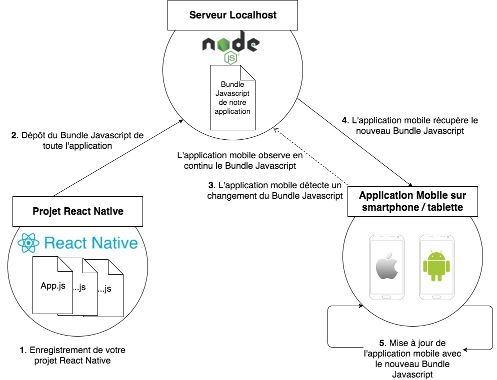

# Application MoviesAndMe

## Initialiser et démarrer un nouveau projet

1. `cd #_ProjetsReactNative_#`
1. `expo init MoviesAndMe`
1. `cd MoviesAndMe`
1. `code .` : ouvrir le dossier du projet dans votre éditeur de code
1. `expo start`

## Fichier App.js

remplacer
`<Text>Open up App.js to start working on your app!</Text>`  
par
`<Text>Hello !</Text>`  
et constater le changement !  
Si ça ne fonctionne pas :

- Sur Mac : soit ⌘ R soit ⌘ D et ensuite Reload
- Sur PC : soir R R soit Ctrl M puis Reload

En savoir plus : [Pont React Native (en)](https://hackernoon.com/understanding-react-native-bridge-concept-e9526066ddb8)
