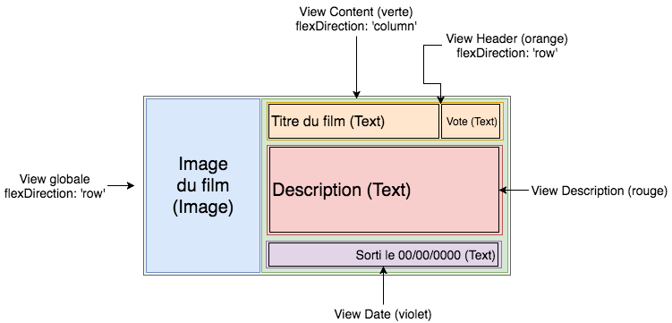

# Props et State

## Gestion de la liste

On va reprendre notre bouton de recherche

```javascript
class Search extends React.Component {
  render() {
    return (
      <View style={styles.main_container}>
        <TextInput style={styles.textinput} placeholder="Titre du film" />
        <Button title="Rechercher" onPress={() => {}} />
      </View>
    )
  }
}
```

Le composant FlatList nous permet d'afficher une liste d'éléments
Le composant Text nous permet d'afficher du texte

```javascript
import { FlatList, Text } from 'react-native'
```

On créé un dictionnaire et on l'affiche dans la flatlist

```javascript
data={ [ {key: 'a'}, {key: 'b'}]}
```

L'attribut `renderItem` défini comment chaque élement de la liste doit être affiché.  
La boucle est "automatique". On utilise uen fonction fléchée Javascript.

```javascript
  renderItem={({item}) => <Text>{item.key}</Text>
    **est équivalent à**
renderItem={function ({item}) { return <Text>{item.title}</Text> }}
```

```javascript
<FlatList
  data={[{ key: 'a' }, { key: 'b' }]}
  renderItem={({ item }) => <Text>{item.key}</Text>}
/>
```

\*\*Par défaut FlatList a sont stylés `flex: 1` et pour changer cela il faut l'encapsuler dans une `<View>`

Maintenant pour avoir une liste de films

- Créons un dossier Helpers
- Mettons-y un fichier filmsData.js\*

```javascript
// Helpers/filmsData.js

let films = [
  {
    id: 181808,
    vote_average: 7.2,
    title: 'Star Wars VIII - Les derniers Jedi',
    poster_path: '',
    original_title: 'Star Wars: The Last Jedi',
    overview:
      'Nouvel épisode de la saga. Les héros du Réveil de la force rejoignent les figures légendaires de la galaxie dans une aventure épique qui révèle des secrets ancestraux sur la Force et entraîne de choquantes révélations sur le passé…',
    release_date: '2017-12-13',
  },
  {
    id: 181809,
    vote_average: 8.1,
    title: 'La Guerre des étoiles',
    poster_path: '',
    original_title: 'Star Wars',
    overview:
      "Il y a bien longtemps, dans une galaxie très lointaine... La guerre civile fait rage entre l'Empire galactique et l'Alliance rebelle. Capturée par les troupes de choc de l'Empereur menées par le sombre et impitoyable Dark Vador, la princesse Leia Organa dissimule les plans de l’Étoile Noire, une station spatiale invulnérable, à son droïde R2-D2 avec pour mission de les remettre au Jedi Obi-Wan Kenobi. Accompagné de son fidèle compagnon, le droïde de protocole C-3PO, R2-D2 s'échoue sur la planète Tatooine et termine sa quête chez le jeune Luke Skywalker. Rêvant de devenir pilote mais confiné aux travaux de la ferme, ce dernier se lance à la recherche de ce mystérieux Obi-Wan Kenobi, devenu ermite au cœur des montagnes désertiques de Tatooine...",
    release_date: '1977-05-25',
  },
]

export default films
```

Dans Search.js

- Importer le filmsData

```javascript
import films from '../Helpers/filmsData'
```

- Affiner la méthode renterItem

```javascript
<FlatList data={films} renderItem={({ item }) => <Text>{item.title}</Text>} />
```

- Préciser quel champ utiliser pour la clé, si on n'a pas un champ key de type String

```javascript
keyExtractor={(item) => item.id.toString()}
```

A faire : dans la liste, à la place du `<Text>` créer un style pour afficher les films




```javascript
<FlatList data={films} renderItem={({ item }) => <FilmItem film={item} />} />
```

```javascript
// Components/FilmItem.js
import React from 'react'
import { View, Text } from 'react-native'

class FilmItem extends React.Component {
  render() {
    const film = this.props.film
    console.log('test:' + this.props.film.title)
    return (
      <View>
        <Text>{film.title}</Text>
      </View>
    )
  }
}

export default FilmItem
```

## Props

En React Native les propriétés d'un composant s'appellent les **props** comme l'attribut `style`
Voir par exemple les [props du composant Text](https://reactnative.dev/docs/text#props)

On peut ajouter notre prop `firstLetterColor={{color:'red'}}`. Pour l'instant cette Prop n'existe pas dans le composant Text mais on peut l'ajouter.

Vérifier dans FilmItem

```javascript
    render() {
        console.log(this.props.film.title)


/*
comme si on avait

  class FilmItem {
      var film;
  }
  var filmItem = new FilmItem();
  filmItem.film = item;
*/
```

```javascript
// FilmItem
    render() {
        const film = this.props.film
        ...
                <Image
                    style={styles.image}
                    source={{
                        uri: 'https://reactnative.dev/img/tiny_logo.png',
                    }}
                />
```

```javascript
const styles = StyleSheet.create({
  image: {
    width: 20,
    height: 20,
  },
})
```

Pour l'image on verra plus tard comment récupérer l'image  
Pour l'instant on peut mettre `Assets/filmVide.png`


Créer le dossier `Assets`et y placer le fichier `filmVide.png`

```javascript
<Image style={styles.image} source={require('../Assets/filmVide.png')} />
```

## State

### API TMDB

L'API TMDB (The Movie DataBase) [documentation](https://www.themoviedb.org/documentation/api?language=fr) permet de récupérer des informations sur les films en français. Il faut [créer un compte](https://www.themoviedb.org/account/signup?language=fr) en chosissant l'option `Développeur` (et non pas ~~professionnel~~).

**ATTENTION Prenez bien le token dans "Clé de l'API (v3 auth)". Ne faites pas l'erreur de prendre "Jeton d'accès en lecture à l'API (v4 auth)".**

- S'inscrire
- Récupérer l'API_TOKEN
- [Documentation recherche](https://developers.themoviedb.org/3/getting-started/search-and-query-for-details)

### Installation et documentation AXIOS

- Installer axios `yarn add axios`
- Exemple de requête API avec AXIOS :

```javascript
import axios from 'axios'
const baseUrl = 'https://reqres.in'

// Passing configuration object to axios
const fetchUser = async () => {
  const configurationObject = {
    method: 'get',
    url: `${baseUrl}/api/users/1`,
  }
  const response = await axios(configurationObject)
  console.log(response.data)
}

// Invoking get method to perform a GET request
const fetchUser = async () => {
  const url = `${baseUrl}/api/users/1`
  const response = await axios.get(url)
  console.log(response.data)
}
```

Créer une instance axios

```javascript
const axiosInstance = axios.create({ baseURL: 'https://reqres.in/' })

axiosInstance.get('api/users/1').then((response) => {
  console.log(response.data)
})
```

[Une documentation AXIOS et React Native](https://blog.logrocket.com/using-axios-react-native-manage-api-requests/)

### Ecrire le code pour l'appel API

- Créer un dossier API
- Créer un fichier API/TMDBApi.js

`TMDBApi.js` : fonction et URL pour l'appel API

Voir la [documentation](https://developers.themoviedb.org/3/search/search-movies)

Pour stocker la clé API télécharger le paquet `react-native-dotenv`:

`yarn add react-native-dotenv`

L'ajouter dans `babel.config.js` :

```javascript
  …
  return {
    … ,
    plugins: [['module:react-native-dotenv']],
  }
}
```

Ajouter `.env` dans le fichier `.gitignore`

Ajouter un fichier `.env` au même niveau que `App.js` :

```bash
API_TOKEN=VOTRE_TOKEN_ICI
```

Créer le fichier `API/TMDBApi.js` et importer la clé :

```javascript
// API/TMDBApi.js
import axios from 'axios'
import { API_TOKEN } from '@env'

const getFilmsFromApiWithSearchedText = async (text) => {
  const url =
    'https://api.themoviedb.org/3/search/movie?api_key=' +
    API_TOKEN +
    '&language=fr&query=' +
    text
}

export default getFilmsFromApiWithSearchedText
```

TMDBApi.js : fonction getFilmsFromApiWithSearchedText complète, avec log et export

```javascript
const getFilmsFromApiWithSearchedText = async (text) => {
  const url =
    'https://api.themoviedb.org/3/search/movie?api_key=' +
    API_TOKEN +
    '&language=fr&query=' +
    text
  const response = await axios.get(url)
  console.log('--getFilmsFromApiWithSearchedText--')
  console.log(url)
  console.log(response.data)
  console.log('--fin getFilmsFromApiWithSearchedText--')
  return response.data
}

export default getFilmsFromApiWithSearchedText
```

Composant Search : ajout de la fonction \_loadFilms

```javascript
import getFilmsFromApiWithSearchedText from '../API/TMDBApi'

class Search extends React.Component {
// Fonction _loadFilms qui effectue l'appel API
// Vérification avec console.log
//     data est un objet Javascript
//     data.results est un tableau Javascript avec les films
_loadFilms() {
    getFilmsFromApiWithSearchedText('star').then(data =>
      console.log(
        '--_loadFilms\n' + JSON.stringify(data)+ '\n_loadFilms--'
        + data.results[0].original_title + '\n--_loadFilms--'

        ));
}
// ...

// Activation de l'événement onPress
<Button title='Rechercher' onPress={() => this._loadFilms()}/>
```

Composant Search : création de la liste de films au niveau de la classe

```javascript
// Components/Search.js
// commenter import films from '../Helpers/filmsData'
class Search extends React.Component {

  // ajouter la prop films, une liste vide au départ
  constructor(props) {
    super(props)
    this._films = []      // ceci va devenir un state
  }

  //...
  _loadFilms() {
    getFilmsFromApiWithSearchedText('star').then((data) => {
      this._films = data.results;
      this.forceUpdate();   // on va remplacer ceci par un state
    });
  }

  // la flatlist affiche la prop
  <FlatList
    data={this._films}

  //...
}
```

## Différence entre prop et state

**Les props (que l'on a déjà vues) sont fixées par le component parent et ne peuvent pas être modifiées par le component qui les reçoit.** Le component parent peut les changer.

**Dès lors que vous souhaitez modifier votre component et ses données affichées, vous allez utiliser son state.**

Ci-dessous :

- films fait partie du State du composant
- avec setState on change l'état du State et on actualise l'interface
- seuls les changements nécessaires sont effectués

```javascript
constructor(props) {
    super(props)
    // films est dans le state : l'interface sera actualisée à chaque appel de setState
    this.state = { films: [] }
}
// ...
render()
//..
  console.log('RENDER')
  return //...
  //...
<FlatList
  // les données de la FlatList doivent être actualisées à chaque appel de setState
  data={this.state.films}

//...

_loadFilms() {
    getFilmsFromApiWithSearchedText('star').then(data => {
        // appel de setSate, actualistion automatique de la Flatlist
        this.setState({ films: data.results })
        // enlever le forceUpdate()
    })
}

```

Optimisation de la recherche : événement onChangeText

```javascript
// Dans le constructeur
this.searchedText = ''

// Nouvelle méthode
  _searchTextInputChanged(text) {
    this.searchedText = text // Modification du texte recherché à chaque saisie de texte, sans passer par setState
  }

// Adaptation de _loadFilms
_loadFilms() {
    getFilmsFromApiWithSearchedText(this.searchedText)

// Au niveau du TextInput
  <TextInput
    placeholder='Titre du film'
    style={{ styles }}
    onChangeText={(text) => this._searchTextInputChanged(text)}
  />
```

Cela fonctionne bien si on clique sur 'Rechercher'.  
Cela ne fonctionne pas si on appuie sur Entrée  
Regarder la documentation sur TextInput et trouver comment faire pour que cela fonctionne aussi
en appuyant sur la touche Entrée.

Fichier Search.js complet (sans la touche entrée)

```javascript
// Components/Search.js

import React from 'react'
import {
  StyleSheet,
  View,
  TextInput,
  Button,
  Text,
  FlatList,
} from 'react-native'
import FilmItem from './FilmItem'
import { getFilmsFromApiWithSearchedText } from '../API/TMDBApi'

class Search extends React.Component {
  constructor(props) {
    super(props)
    this.searchedText = '' // Initialisation de notre donnée searchedText en dehors du state
    this.state = {
      films: [],
    }
  }

  _loadFilms() {
    if (this.searchedText.length > 0) {
      // Seulement si le texte recherché n'est pas vide
      getFilmsFromApiWithSearchedText(this.searchedText).then((data) => {
        this.setState({ films: data.results })
      })
    }
  }

  _searchTextInputChanged(text) {
    this.searchedText = text // Modification du texte recherché à chaque saisie de texte, sans passer par setState
  }

  render() {
    //console.log('RENDER')
    return (
      <View style={styles.main_container}>
        <TextInput
          style={styles.textinput}
          placeholder="Titre du film"
          onChangeText={(text) => this._searchTextInputChanged(text)}
        />
        <Button title="Rechercher" onPress={() => this._loadFilms()} />
        <FlatList
          data={this.state.films}
          keyExtractor={(item) => item.id.toString()}
          renderItem={({ item }) => <FilmItem film={item} />}
        />
      </View>
    )
  }
}

const styles = StyleSheet.create({
  main_container: {
    flex: 1,
    marginTop: 20,
  },
  textinput: {
    marginLeft: 5,
    marginRight: 5,
    height: 50,
    borderColor: '#000000',
    borderWidth: 1,
    paddingLeft: 5,
  },
})

export default Search
```
