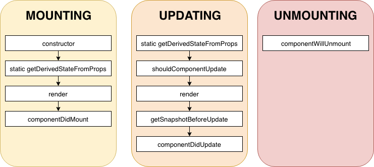

#

Création de l'appel API pour le film

```javascript
// API/TMDBApi.js

const getFilmDetailFromApi = async (id) => {
  const url =
    'https://api.themoviedb.org/3/movie/' +
    id +
    '?api_key=' +
    API_TOKEN +
    '&language=fr'
  const response = await axios.get(url)
  return response.data
}

export { getFilmsFromApiWithSearchedText, getFilmDetailFromApi }

// Component/FilmDetail.js
import { getFilmDetailFromApi } from '../API/TMDBApi'
```

Ajout du isLoaded dans FilmDetail

```javascript
// Components/FilmDetail.js

import React from 'react'
import { StyleSheet, View, ActivityIndicator } from 'react-native'

class FilmDetail extends React.Component {
  constructor(props) {
    super(props)
    this.state = {
      film: undefined, // Pour l'instant on n'a pas les infos du film, on initialise donc le film à undefined.
      isLoading: true, // A l'ouverture de la vue, on affiche le chargement, le temps de récupérer le détail du film
    }
  }

  _displayLoading() {
    if (this.state.isLoading) {
      // Si isLoading vaut true, on affiche le chargement à l'écran
      return (
        <View style={styles.loading_container}>
          <ActivityIndicator size="large" />
        </View>
      )
    }
  }

  render() {
    const { idFilm } = this.props.navigation.getParam('idFilm')
    return (
      <View style={styles.main_container}>
        {this._displayLoading()}
        <Text>Détail du film id {idFilm}</Text>
      </View>
    )
  }
}

const styles = StyleSheet.create({
  main_container: {
    flex: 1,
  },
  loading_container: {
    position: 'absolute',
    left: 0,
    right: 0,
    top: 0,
    bottom: 0,
    alignItems: 'center',
    justifyContent: 'center',
  },
})

export default FilmDetail
```

Voir le [Cycle de Vie](https://projects.wojtekmaj.pl/react-lifecycle-methods-diagram/) des Composants React Native


Voir la [documentation](https://fr.reactjs.org/docs/react-component.html#the-component-lifecycle)

Observer le Cycle de vie de FilmDetail

```javascript
componentDidMount() {
  console.log("Component FilmDetail monté")

}

componentDidUpdate(prevProps, prevState, snapshot) {
  console.log("Component FilmDetail componentDidUpdate")
}

componentWillUnmount() {
  console.log("Component FilmDetail componentWillUnmount")
}

render() {
  const { idFilm } = this.props.navigation.state.params
  console.log("Component FilmDetail rendu idFilm = " + idFilm)
  return (  /* ... */ )
  // ...
}
```

Ajout de l'appel API détail dans `componentDidMount`

```javascript
componentDidMount() {
    console.log("Component FilmDetail monté")
    getFilmDetailFromApi(this.props.navigation.getParam('idFilm')).then(data => {
      this.setState({
        film: data,
        isLoading: false
      })
    })
  }
```

Ajout d'une fonction `_displayFilm` avec un composant `ScrollView` pour afficher tous les détails du film

```javascript

import React from "react";
import { StyleSheet, View, Text, ActivityIndicator, ScrollView } from "react-native";
import { getFilmDetailFromApi } from "../API/TMDBApi";


  _displayFilm() {
    if (this.state.film != undefined) {
      return (
        <ScrollView style={ styles.scrollview_container }>
          <Text>{ this.state.film.title }</Text>
          <JSONPretty data={ this.state.film } ></JSONPretty>
        </ScrollView>
      )
    }
  }

  render() {
    return (
      <View style={styles.main_container}>
        {this._displayLoading()}
        {this._displayFilm()}
      </View>
    )
  }
```

Fichier FilmDetail complet

```javascript
// Components/FilmDetails.js

import React from 'react'
import {
  StyleSheet,
  View,
  Text,
  ActivityIndicator,
  ScrollView,
} from 'react-native'
import { getFilmDetailFromApi } from '../API/TMDBApi'
import 'react-json-pretty/themes/adventure_time.css'
import JSONPretty from 'react-json-pretty'

class FilmDetail extends React.Component {
  constructor(props) {
    super(props)
    this.state = {
      film: undefined, // Pour l'instant on n'a pas les infos du film, on initialise donc le film à undefined.
      isLoading: true, // A l'ouverture de la vue, on affiche le chargement, le temps de récupérer le détail du film
    }
  }

  componentDidMount() {
    console.log('Component FilmDetail monté')
    getFilmDetailFromApi(this.props.navigation.state.params.idFilm).then(
      (data) => {
        this.setState({
          film: data,
          isLoading: false,
        })
      }
    )
  }

  componentDidUpdate(prevProps, prevState, snapshot) {
    console.log('Component FilmDetail componentDidUpdate')
  }

  componentWillUnmount() {
    console.log('Component FilmDetail componentWillUnmount')
  }

  _displayLoading() {
    if (this.state.isLoading) {
      // Si isLoading vaut true, on affiche le chargement à l'écran
      return (
        <View style={styles.loading_container}>
          <ActivityIndicator size="large" />
        </View>
      )
    }
  }

  _displayFilm() {
    if (this.state.film != undefined) {
      return (
        <ScrollView style={styles.scrollview_container}>
          <Text>{this.state.film.title}</Text>
          <JSONPretty data={this.state.film}></JSONPretty>
        </ScrollView>
      )
    }
  }

  render() {
    const { idFilm } = this.props.navigation.getParam('idFilm')
    console.log('Component FilmDetail rendu idFilm = ' + idFilm)
    return (
      <View style={styles.main_container}>
        {this._displayLoading()}
        {this._displayFilm()}
      </View>
    )
  }
}

const styles = StyleSheet.create({
  main_container: {
    flex: 1,
  },
  loading_container: {
    position: 'absolute',
    left: 0,
    right: 0,
    top: 0,
    bottom: 0,
    alignItems: 'center',
    justifyContent: 'center',
  },
})

export default FilmDetail
```
