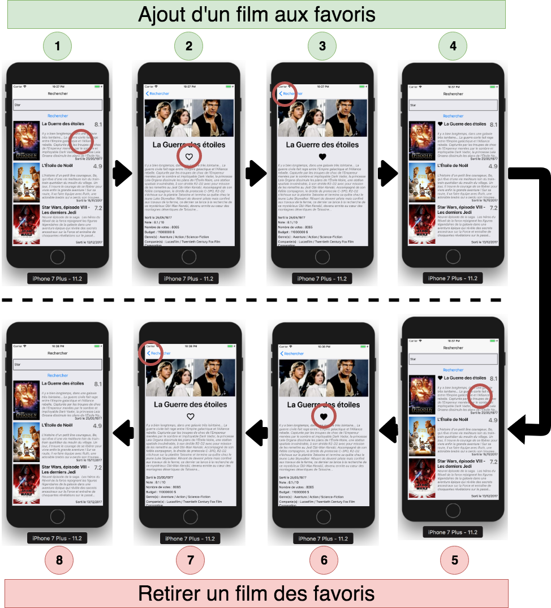
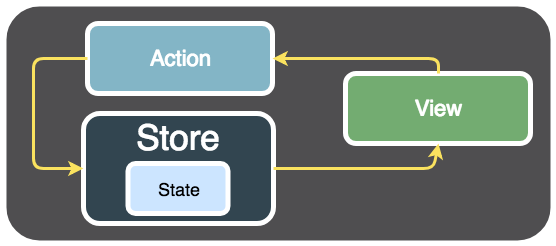
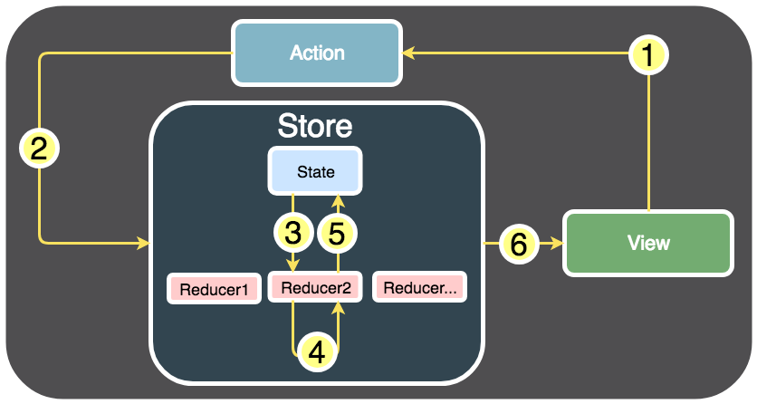
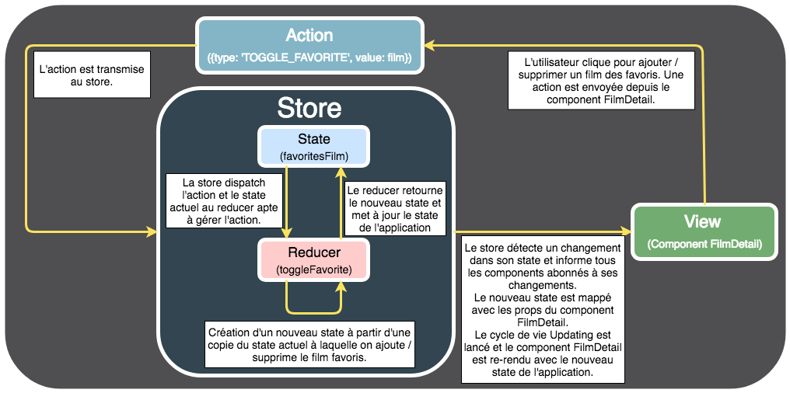
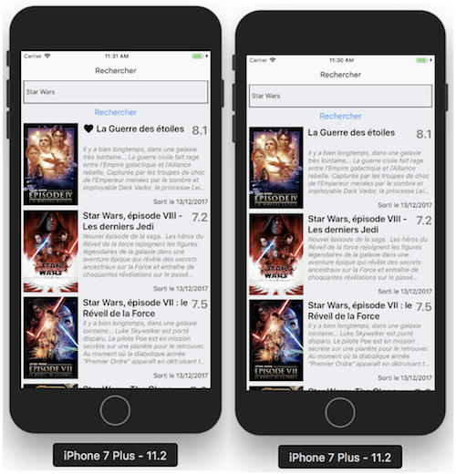

# Persistance des données avec Redux

## Redux





- La View crée et envoie une action.
- Cette action est récupérée par le store.
- Le store modifie le state de votre application en fonction de l'action reçue.
- La View détecte les changements du state global et se re-rend.

## Reducer

Un reducer est une fonction créée dans le store. Cette fonction a pour rôle de modifier le state de votre application en fonction d'une action reçue. Ce n'est donc pas le store qui modifie directement le state de votre application, mais un reducer contenu dans le store.

## Objectif : gérer les favoris



1. L'utilisateur clique sur le bouton pour ajouter le film aux favoris, une action est créée.
1. L'action est envoyée au store.
1. Le store possède un ou plusieurs reducers. Un des reducers sait comment gérer cette action, il fait signe au store de lui donner l'action et le state actuel de l'application.
1. Le reducer fait ce qu'il a à faire, il modifie le state de l'application en ajoutant le film aux favoris.
1. Le reducer redonne au store le state mis à jour avec le nouveau film favori.
1. Les components qui utilisent le state global de l'application sont informés qu'un changement a eu lieu et se re-rendent.

## Construction d'une action

Construction d'une action
Une action est, tout simplement, un objet avec deux paramètres :

- un paramètre type qui correspond au type d'action : ajout aux favoris, suppression des favoris, modification du profil, etc. Le type est obligatoire
- un paramètre value qui correspond à l'objet que l'on souhaite modifier dans le state : un film, le profil utilisateur, etc. Ce paramètre est optionnel. _Par exemple, une action pour supprimer tous les films favoris n'aura besoin que d'un type. C'est inutile d'avoir une value ici, avec la liste de tous les films à supprimer. On supprime tout._
- Pour gérer les actions, dans un reducer, on utilise un `switch case`

```javascript
function monReducer(state, action) {
  let nextState
  switch (action.type) {
    case 'ACTION_1':
      // Modification du state de l'application
      return nextState
    case 'ACTION_2':
      // Modification du state de l'application
      return nextState
    //...
    default:
      return state
  }
}
```

**Le state doit toujours rester immuable (cf. [documentation](https://immutable-js.com/)).  
Pour modifier un objet immuable, il faut créer une copie de cet objet (donc créer un nouvel objet) et y appliquer vos modifications.**

Le fait que l'objet soit immuable ajoute beaucoup de robustesse au code. Si une modification du state produit quelque chose d'incohérent, on peut toujours renvoyer le state précédent. Redux est basé sur le paradigme de **_programmation fonctionnelle_**.

Redux va donc nous permettre de gérer un state global avec, pour l'instant, les films favoris de notre application. Ces films seront gérés par un reducer. Lorsque l'on modifiera les films favoris via le reducer, le state de notre application sera mis à jour et tous les éléments graphiques qui en dépendent seront automatiquement mis à jour. C'est le principe du state en React, après tout.

## Intégrer Redux dans notre projet

- `yarn add redux`
- `yarn add react-redux`

```javascript
//  Ici, on a créé un nouvel objet  nextState   dans lequel on a copié le state de l'application  ...state
// Respect du principe d'immuabilité
let nextState
nextState = {
  ...state,
  profil: action.value,
}
```

```javascript
// Store/Reducers/favoriteReducer.js
const initialState = { favoritesFilm: [] }

function toggleFavorite(state, action) {
  let nextState
  switch (action.type) {
    case 'TOGGLE_FAVORITE':
    default:
      return state
  }
}
```

Définir la fonction TOGGLE_FAVORITE pour ajouter ou supprimer un favori

```javascript
// Store/Reducers/favoriteReducer.js

const initialState = { favoritesFilm: [] }

function toggleFavorite(state = initialState, action) {
  let nextState
  switch (action.type) {
    case 'TOGGLE_FAVORITE':
      /*
      La première chose que l'on réalise dans l'action est de vérifier que le film passé via l'action existe dans la liste des films favoris. Souvenez-vous, on fait passer l'objet d'une action (ici notre film) dans le champ value (d'où le code action.value). Pour savoir si le film est déjà présent dans la liste des films favoris, on utilise la fonction findIndex en Javascript qui retourne l'index de l'élément dans le tableau s'il existe, sinon elle renvoie -1
      */
      const favoriteFilmIndex = state.favoritesFilm.findIndex(
        (item) => item.id === action.value.id,
      )
      if (favoriteFilmIndex !== -1) {
        // Le film est déjà dans les favoris, on le supprime de la liste
        nextState = {
          ...state,
          favoritesFilm: state.favoritesFilm.filter(
            (item, index) => index !== favoriteFilmIndex,
          ),
        }
      } else {
        // Le film n'est pas dans les films favoris, on l'ajoute à la liste
        nextState = {
          ...state,
          favoritesFilm: [...state.favoritesFilm, action.value],
        }
      }
      // renvoie l'objet  nextState  si celui-ci n'est pas undefined, sinon on renvoie l'objet  state
      // code robuste
      return nextState || state
    default:
      return state
  }
}

export default toggleFavorite
```

-1.

- On initialise un nouvel objet `nextState` avec une copie du state `...state`
- Puis, on redéfinit les films favoris de l'objet `nextState` avec un tableau qui correspond aux films favoris du `state` , auquel on a enlevé le film à l'index spécifié (fonction `filter` )

Création du Store

- On initialise le store en lui faisant passer notre reducer
- On peut avoir plusieurs reducers dans un store

```javascript
// Store/configureStore.js

import { createStore } from 'redux'
import toggleFavorite from './Reducers/favoriteReducer'

// On initialise le store en lui faisant passer notre reducer.
export default createStore(toggleFavorite)
```

Utilisation du Store via le Provider
Le Provider met le store à disposition dans toute l'application

```javascript
// App.js

import React from 'react'
import Navigation from './Navigation/Navigation'
import { Provider } from 'react-redux'
import Store from './Store/configureStore'

export default class App extends React.Component {
  render() {
    return (
      <Provider store={Store}>
        <Navigation />
      </Provider>
    )
  }
}
```

Maintenant il faut connecter le Component au Store.

- Voir la documentation [mapStateToProps](https://react-redux.js.org/using-react-redux/connect-mapstate)
- Si on spécifie mapStateToProps dans la fonction connect, automatiquement, le component est abonné aux changements du store Redux.
- Cela permet de mapper (d'associer) le state de notre application dans les props du component FilmDetail.
- On ne connecte pas tout le store mais uniquement ce dont on a besoin : state.favoritesFilm
- Explication en image 

```javascript
// Components/FilmDetail.js

//...
import { connect } from 'react-redux'

//...

const mapStateToProps = (state) => {
  return {
    favoritesFilm: state.favoritesFilm,
  }
}

export default connect(mapStateToProps)(FilmDetail)
```

À présent, dans les props du component FilmDetail, vous avez accès au state de l'application et donc aux films favoris. Vérifiez avec les logs :

```javascript
// Components/FilmDetail.js

class FilmDetail extends React.Component {
    //...

    render() {
        console.log(this.props) /* "favoritesFilm": Array [] */
        return (
            //...
        )
    }
}
```

Lorsque vous allez ajouter un film aux favoris, le state de votre application va être mis à jour. Le store Redux va détecter ce changement et notifier tous les components connectés à votre store Redux, vous savez, tous les components que l'on a connectés grâce à la définition du paramètre `mapStateToProps`.

La méthode [`dispatch`](https://react-redux.js.org/api/connect) permet de mettre à jour le store. [En savoir plus](https://egghead.io/lessons/react-redux-generating-containers-with-connect-from-react-redux-visibletodolist)

- Utilisation d'un composant `Pressable` car ke composant `Button` n'est pas configurable
- Evénement `onPress`
- Pour choisir le texte du `Pressable` on va inclure un composant `Text` à l'intérieur du `Pressable`

```javascript
// Components/FilmDetail.js

import { Pressable } from 'react-native'

    _toggleFavorite() {
        // Action Redux
        const action = { type: "TOGGLE_FAVORITE", value: this.state.film }
        // Envoi de l'action au Store Redux
        this.props.dispatch(action)
    }

    _displayFilm() {
        // ...
        <Text style={styles.title_text}>{film.title}</Text>
        <Pressable style={styles.favorite} onPress={() => this._toggleFavorite()}>
          <Text>{"Favoris"}</Text>
        </Pressable>

```

Vérification de l'événement `componentDidUpdate`

```javascript

  componentDidUpdate() {
    console.log("componentDidUpdate : ")
    console.log(this.props.favoritesFilm)
  }
```

- Texte pour activer/décactiver les favoris : ♡ ♥ `textFavori = '♡'`
- Si le film se trouve dans la liste des favoris, texte = ♥ sinon texte = ♡
  `<Text>{this.props.favoritesFilm.findIndex((item) => item.id === this.state.film.id) !== -1 ? "♥" : "♡"} </Text>`
- Style du Pressable : `favorite: { alignItems: "center", },`

```javascript
// Components/FilmDetail.js

    _toggleFavorite() {
        // Action Redux
        const action = { type: "TOGGLE_FAVORITE", value: this.state.film }
        // Envoi de l'action au Store Redux
        this.props.dispatch(action)
    }

    _displayFilm() {
        // ...
        <Text style={styles.title_text}>{film.title}</Text>
        <Pressable
            style={styles.favorite}
            // ...
          >
            <Text>
              {this.props.favoritesFilm.findIndex(
                (item) => item.id === this.state.film.id
              ) !== -1
                ? "♥"
                : "♡"}
            </Text>
          </Pressable>/>


  // Dans les styles


  favorite: {
    alignItems: "center",
  },
```

FilmDetail.js complet

```javascript
// Components/FilmDetail.js

import React from 'react'
import JSONPretty from 'react-json-pretty'
import {
  Pressable,
  StyleSheet,
  View,
  Text,
  Image,
  ActivityIndicator,
  ScrollView,
} from 'react-native'
import { getFilmDetailFromApi, getImageFromApi } from '../API/TMDBApi'
import 'react-json-pretty/themes/adventure_time.css'
import moment from 'moment'
import numeral from 'numeral'
import { connect } from 'react-redux'

class FilmDetail extends React.Component {
  constructor(props) {
    super(props)
    this.state = {
      film: undefined,
      isLoading: true,
    }
  }

  componentDidMount() {
    console.log('Component FilmDetail monté')
    getFilmDetailFromApi(this.props.navigation.state.params.idFilm).then(
      (data) => {
        this.setState({
          film: data,
          isLoading: false,
        })
      },
    )
  }

  componentDidUpdate(prevProps, prevState, snapshot) {
    console.log('Component FilmDetail componentDidUpdate')
    console.log('<this.props.favoritesFilm>')
    console.log(this.props.favoritesFilm)
    console.log('</this.props.favoritesFilm>')
  }

  componentWillUnmount() {
    console.log('Component FilmDetail componentWillUnmount')
  }

  _toggleFavorite() {
    const action = { type: 'TOGGLE_FAVORITE', value: this.state.film }
    this.props.dispatch(action)
  }

  _displayFilm() {
    const { film } = this.state
    if (film != undefined) {
      return (
        <ScrollView style={styles.scrollview_container}>
          <Image
            style={styles.image}
            source={{ uri: getImageFromApi(film.poster_path) }}
          />
          <Text style={styles.title_text}>{film.title}</Text>
          <Pressable
            style={styles.favorite}
            onPress={() => this._toggleFavorite()}
          >
            <Text>
              {this.props.favoritesFilm.findIndex(
                (item) => item.id === this.state.film.id,
              ) !== -1
                ? '♥'
                : '♡'}
            </Text>
          </Pressable>
          <Text style={styles.description_text}>{film.overview}</Text>
          <Text style={styles.default_text}>
            Sorti le {moment(new Date(film.release_date)).format('DD/MM/YYYY')}
          </Text>
          <Text style={styles.default_text}>
            Note : {film.vote_average} / 10
          </Text>
          <Text style={styles.default_text}>
            Nombre de votes : {film.vote_count}
          </Text>
          <Text style={styles.default_text}>
            Budget : {numeral(film.budget).format('0,0[.]00 $')}
          </Text>
          <Text style={styles.default_text}>
            Genre(s) :{' '}
            {film.genres
              .map(function (genre) {
                return genre.name
              })
              .join(' / ')}
          </Text>
          <Text style={styles.default_text}>
            Companie(s) :{' '}
            {film.production_companies
              .map(function (company) {
                return company.name
              })
              .join(' / ')}
          </Text>
        </ScrollView>
      )
    }
  }

  _displayLoading() {
    if (this.state.isLoading) {
      return (
        <View style={styles.loading_container}>
          <ActivityIndicator size="large" />
        </View>
      )
    }
  }

  render() {
    const { idFilm } = this.props.navigation.getParam('idFilm')
    console.log('Component FilmDetail rendu idFilm = ' + idFilm)
    return (
      <View View style={styles.main_container}>
        {this._displayLoading()}
        {this._displayFilm()}
      </View>
    )
  }
}

const styles = StyleSheet.create({
  main_container: {
    flex: 1,
  },
  loading_container: {
    position: 'absolute',
    left: 0,
    right: 0,
    top: 0,
    bottom: 0,
    alignItems: 'center',
    justifyContent: 'center',
  },
  scrollview_container: {
    flex: 1,
  },
  image: {
    height: 169,
    margin: 5,
  },
  title_text: {
    fontWeight: 'bold',
    fontSize: 35,
    flex: 1,
    flexWrap: 'wrap',
    marginLeft: 5,
    marginRight: 5,
    marginTop: 10,
    marginBottom: 10,
    color: '#000000',
    textAlign: 'center',
  },
  description_text: {
    fontStyle: 'italic',
    color: '#666666',
    margin: 5,
    marginBottom: 15,
  },
  default_text: {
    marginLeft: 5,
    marginRight: 5,
    marginTop: 5,
  },
  favorite: {
    alignItems: 'center',
  },
})

const mapStateToProps = (state) => {
  return {
    favoritesFilm: state.favoritesFilm,
  }
}

export default connect(mapStateToProps)(FilmDetail)
```

## Exercice : mettre à jour la vue recherche

La vue Liste devrait ressembler à cela (le ♥ n'est pas cliquable) :



- Connecter le store Redux au component Search,
- Faire passer à nos components FilmItem une prop `isFilmFavorite`
- Pour les FlatList : `this.props.favoritesFilm` change mais `this.state.films` ne change pas donc la liste ne peut pas s'actualiser
- Pour quel la liste se mettre à jour, utiliser la prop [`extraData`](https://facebook.github.io/react-native/docs/flatlist#extradata) de la `FlatList`. Dans notre cas : `extraData={this.props.favoritesFilm}`. Une FlatList est un [PureComponent](https://reactjs.org/docs/react-api.html#reactpurecomponent)

[Cours sur Redux](https://egghead.io/courses/fundamentals-of-redux-course-from-dan-abramov-bd5cc867)
