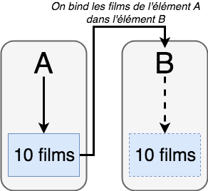
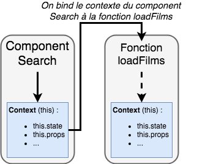

# Databinding

```javascript
import React from "react"
import { View } from "react-native"

class MonComponent extends React.Component {
  constructor(props) {
    super(props)
    this.searchedText = "Star wars"
  }

  _maFonction(functionCallback) {
    console.log("Log 2 | searchedText : " + this.searchedText)
    functionCallback()
  }

  _maFonctionATransmettre() {
    // undefined
    console.log("Log 3 | searchedText : " + this.searchedText)
  }

  render() {
    console.log("Log 1 | searchedText : " + this.searchedText)
    this._maFonction(this._maFonctionATransmettre)
    return <View></View>
  }
}

export default MonComponent
```





[Approches du Data Binding](https://www.freecodecamp.org/news/react-binding-patterns-5-approaches-for-handling-this-92c651b5af56/)
